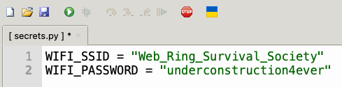
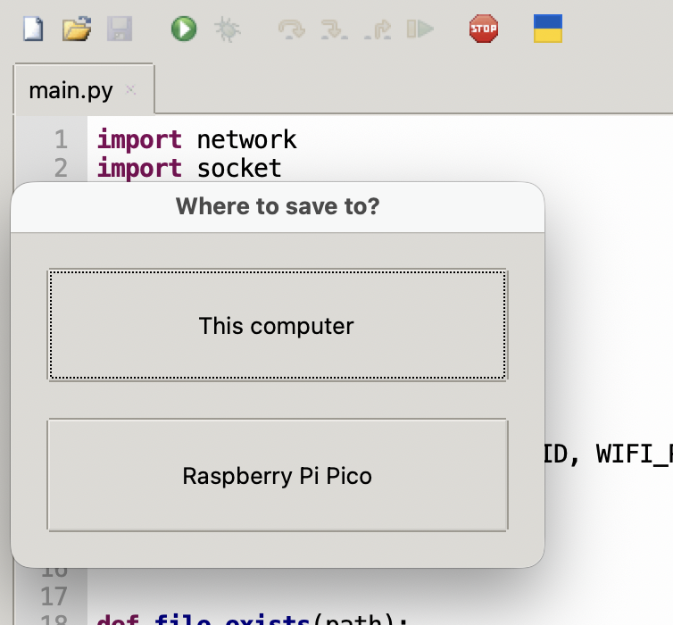
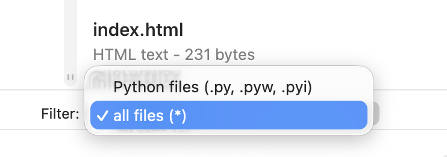
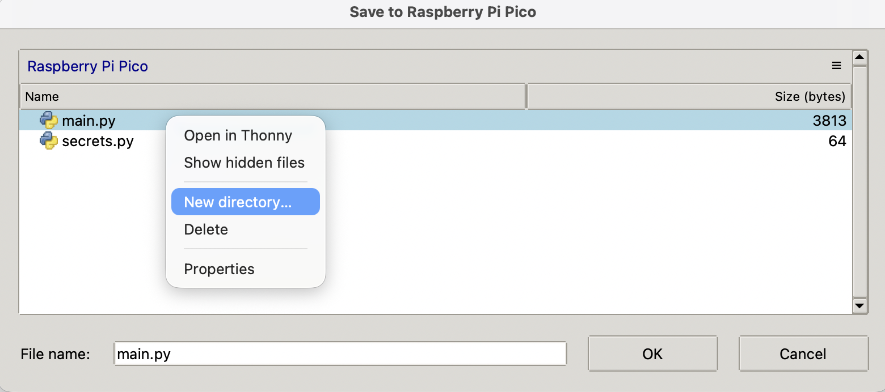
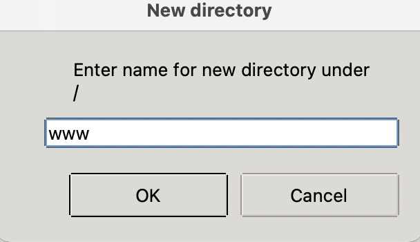
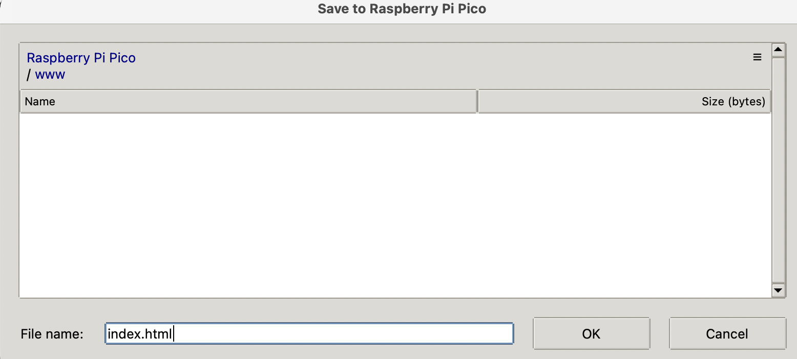
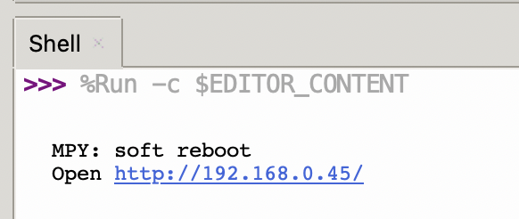
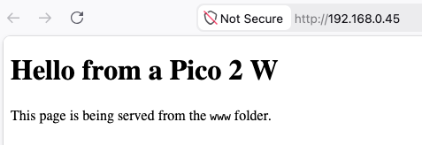
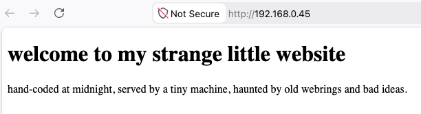
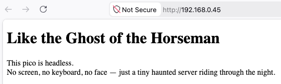

# Serve a webpage from your Pico 2 W

## Connect your Raspberry Pi Pico

Connect your Raspberry Pi Pico to your computer, and access it using Thonny. [You can follow the instructions in this project if you need guidance.](https://projects.raspberrypi.org/en/projects/getting-started-with-the-pico/0)

## Project files

Download these project files:

- [main.py](resources/main.py)
- [index.html](resources/index.html)

## Create `secrets.py`

> [!TASK]
>
> In Thonny, create a new file called `secrets.py`.
>
> Add your Wi-Fi name and password:
>
> ```python
> WIFI_SSID = "YOUR_WIFI_NAME"
> WIFI_PASSWORD = "YOUR_WIFI_PASSWORD"
> ```

> [!TASK]
>
> Save the `secrets.py` file **to the Pico**.
>
> 

## Upload `main.py`

> [!TASK]
>
> Open the downloaded `main.py` in Thonny.
>
> Save it **to the Pico** as `main.py`.
>
> 

## Upload `index.html`

> [!TASK]
>
> Open the downloaded `index.html`. You may have to change the file filter in Thonny to allow **all files** to be opened.
>
> 

> [!TASK]
>
> Save the `index.html` **to the Pico**, and when prompted for a filename, **right-click** to create a new directory.
>
> 
>
> Call the new directory `www` and save the `index.html` file there.
>
> 
>
> 

## Run the web server

> [!TASK]
>
> Go back to `main.py` and click **Run** in Thonny.
>
> If your Pico connects to Wi-Fi, it will print an IP address in the Shell.
>
> It will look something like this:
>
> ```text
> Open http://192.168.0.45/
> ```
>
> Make a note of the address.
>
> 

## Open the page

> [!TASK]
>
> Make sure the computer or phone you are using is on the same Wi-Fi network as the Pico.
>
> Type the Pico's IP address into a web browser.
>
> You should see your web page.
>
> 

## Change the page

> [!TASK]
>
> Open `www/index.html` on the Pico in Thonny.
>
> Change the text in the page, then save the file and refresh the browser.
>
> For example, you could change the heading and paragraph to something else.
>
> 

## Test without Thonny

> [!TASK]
>
> Disconnect the Pico from Thonny.
>
> Power it from USB using a normal power supply.
>
> Wait a few seconds for it to start, then visit the same IP address again.
>
> Your web page should still load.
>
> 
